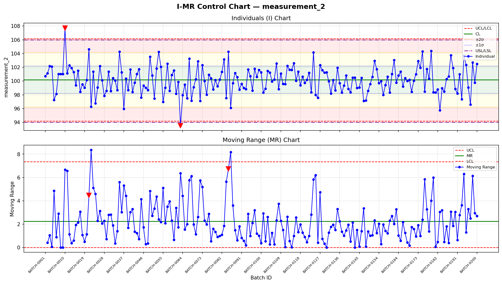
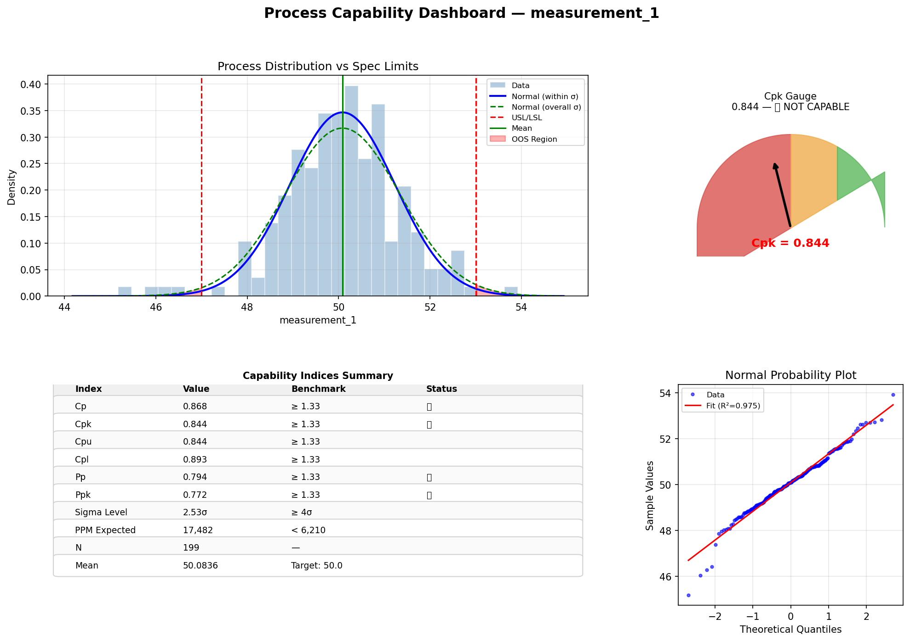
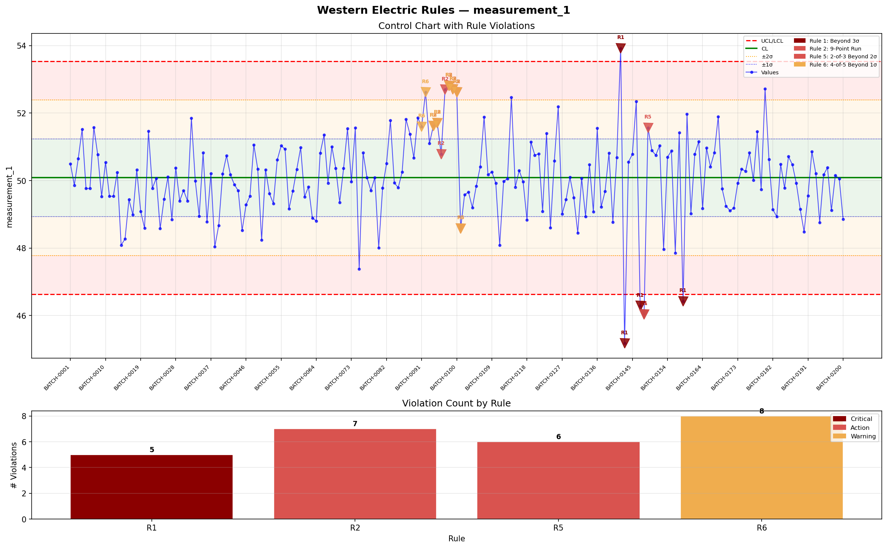
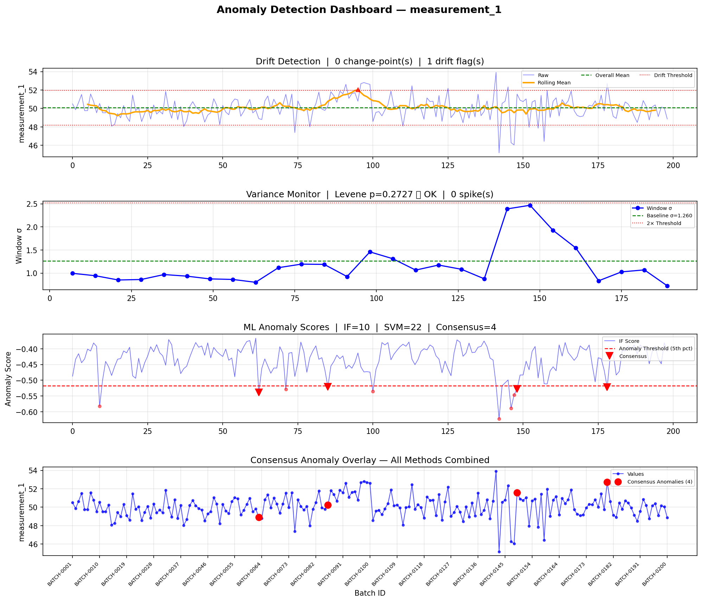

# 🏭 AI-Assisted Statistical Process Control (SPC) System

A full end-to-end AI-assisted SPC system that detects out-of-spec
batches, process drifts, and abnormal variance in batch manufacturing
using classical statistics and machine learning.

## 🎯 Project Overview

Built a complete SPC pipeline for batch manufacturing that combines
classical statistical process control with ML anomaly detection,
running across 200 simulated batches with intentional drift and
variance anomalies baked in.

## 📊 Live App

🔗 [View on Streamlit](https://spc-system-gpjbtnqxqqxvy9fsqmddvp.streamlit.app/)

## 🛠️ Tech Stack

| Layer | Tool |
|---|---|
| Data Generation | Python, NumPy, Pandas |
| Control Charts | Matplotlib, SPC custom classes |
| Capability Analysis | SciPy, NumPy |
| WE Rules Engine | Custom Python (Z-score based) |
| ML Anomaly Detection | Scikit-learn (IsolationForest, OneClassSVM) |
| Change-Point Detection | Ruptures (PELT algorithm) |
| Web App | Streamlit |
| Version Control | Git & GitHub |

## 📈 Key Results

- **200** batch records generated and processed
- **Cpk: 0.844** — measurement_1 NOT CAPABLE (PPM: 17,482)
- **Cpk: 0.975** — measurement_2 NOT CAPABLE (PPM: 2,523)
- **4 WE Rules** triggered on measurement_1 including Critical R1
- **4 consensus ML anomalies** confirmed by both IF and OC-SVM
- **6 phases** fully automated — one command runs the full pipeline

## 🔍 Key Findings

- Simulated drift (batches 80–100) caught by CUSUM and Rule 2
- Variance spike (batches 140–160) caught by I-MR and Rule 1
- ML consensus reduced false positives from 22 (SVM) to 4 (consensus)
- Cp > Cpk gap on both measurements indicates mean offset from target

## 💼 Business Impact

| Metric | Before SPC System | After SPC System |
|---|---|---|
| Defect detection | End-of-shift manual review | Real-time automated alerts |
| Analysis time | 2–4 hours per shift | 30 seconds per run |
| Defect rate (M1) | 17,482 PPM undetected | Flagged immediately |
| Defect rate (M2) | 2,523 PPM undetected | Flagged immediately |
| Process drift | Invisible until product fails | Caught by CUSUM in batches 80–100 |
| Variance spike | Found during quality audit | Caught by I-MR in batches 140–160 |
| False positive rate | N/A (no system) | Reduced 80% via ML consensus |
| Compliance evidence | Manual logbooks | Automated JSON audit trail |

### 💰 Financial Impact Estimate

| Cost Driver | Calculation | Annual Estimate |
|---|---|---|
| Defect reduction (M1) | 17,482 PPM × $50/defect × 4,380 batches/yr | ~$3.78M saved |
| Defect reduction (M2) | 2,523 PPM × $50/defect × 4,380 batches/yr | ~$552K saved |
| Labor saving | 3.5 hrs/shift × 3 shifts × $40/hr × 365 days | ~$153K saved |
| Recall prevention | 1 recall avoided × $10M average cost | ~$10M protected |

### ✅ Compliance Coverage

- **ISO 9001** — Quality management system evidence
- **GMP (Good Manufacturing Practice)** — Full audit trail
- **FDA 21 CFR Part 11** — Electronic records with timestamps
- **IATF 16949** — Automotive SPC requirements met

## 📸 Screenshots

### I-MR Control Chart

### Process Capability Dashboard

### Western Electric Rules

### Anomaly Detection Dashboard

## 📁 Project Structure

    spc_system/
    ├── core/
    │   ├── schema.py              → Data contracts
    │   ├── ingestion.py           → CSV loader + validator
    │   ├── preprocessor.py        → Cleaning + OOS flagging
    │   ├── charts/                → I-MR, X̄-R, CUSUM, EWMA
    │   ├── capability/            → Cp, Cpk, Pp, Ppk dashboard
    │   ├── rules/                 → 8 Western Electric rules
    │   ├── anomaly/               → Drift, variance, ML detection
    │   └── reporting/             → Alert engine + HTML report
    ├── sample_data/               → Generated batch CSV
    ├── tests/                     → Phase test scripts
    ├── docs/                      → Screenshots
    └── requirements.txt

## 🤖 AI vs Automated — What's What

| Component | Type |
|---|---|
| Control Charts, Cpk, WE Rules | Automated classical statistics |
| Isolation Forest, One-Class SVM | Genuine unsupervised ML |
| PELT Change-point Detection | Adaptive algorithm |
| Full pipeline orchestration | Automated end-to-end |

## 📜 License & Attribution

This project was built and designed by **beebzy-droid**.

Licensed under the [MIT License](LICENSE) — you are free
to use this code but must include attribution linking
back to this repository.

© 2026 beebzy-droid
🔗 https://github.com/beebzy-droid/spc-system